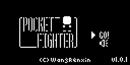

# Pocket Fighter

**Copyright (C) 2017 [Wang Renxin](https://github.com/paladin-t/). All rights reserved.**

The license for the precompiled HEX, and the package is 

## Introduction

Pocket Fighter is a FTG, you can compete with your Arduboy. The CPU will repeat your actions at previous round.

## Installation

### 1. Use the precompiled

* Use an Arduboy uploader to upload the `/out/pocket_fighter.hex` to your Arduboy.
* Or use an Arduboy manager to upload the `/out/pocket_fighter.arduboy` package.

## Control

D-Pad: Left/Right/Up

	Move and jump

D-Pad: Down

	Enter next level if win, or to the menu after game over

A

	Punch

B

	Hadouken

## Rules

1. You are always playing the **bright head**, your opponent is the dark head.
2. Both fighters get max to 3 HP, one will die when all lost.
3. You will enter to next level and get 1 more HP, if the opponent is defeated.
4. The CPU will **repeat your actions at previous round**.
5. Defeat your challengers, and survive as long as you can.

## Support

Any [feedback](mailto:hellotony521@qq.com) are welcome.
